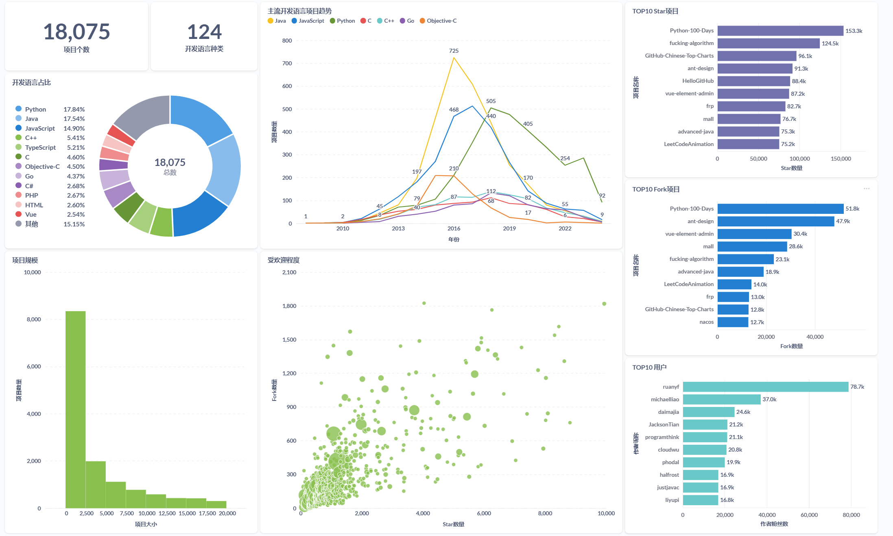

# Github 国内项目收集（data目录)
介绍：

    通过github提供的api，查询location为China或中国的用户，并收集用户stars>=100以及开发语言不为空的仓库项目存入数据库
运行：

    python data/main.py（程序会按周期重新收集项目）

# Github 国内项目列表（app目录)
介绍：

    将收集到的项目按stars数倒序排列，每页展示1000个项目
运行：

    python app/main.py

# 环境配置
    Python + MySQL

# config.py
需要：

    1、填写本地MySQL参数，连接本地数据库
    2、填写github token，增加github api访问次数
    3、填写时间区间，在区间内收集所需数据
    4、填写想要收集的地区
    5、填写收集周期(天)
      (保证收集周期数大于收集时间，推荐7天)

# Metabase仪表盘示例

环境配置

    Metabase
### 1.项目个数、开发语言种类
    显示为数字（Distinct values）
### 2.开发语言占比
    显示为饼状图(维度：开发语言,措施:计数)
### 3.主流开发语言项目趋势
    显示为线段图(X轴:项目创建时间、开发语言(过滤出主流语言),Y轴:计数)
### 4.项目规模
    显示为柱状图(X轴:项目大小(合理分片)；Y轴:计数)
### 5.受欢迎程度
    显示为分散图(气泡大小:项目大小，X轴:Star数量，Y轴:Fork数量)
### 6.TOP10
    显示为划船图(X轴:Star/Fork/粉丝数数量(倒序取前10)，Y轴:项目名称/作者名称)